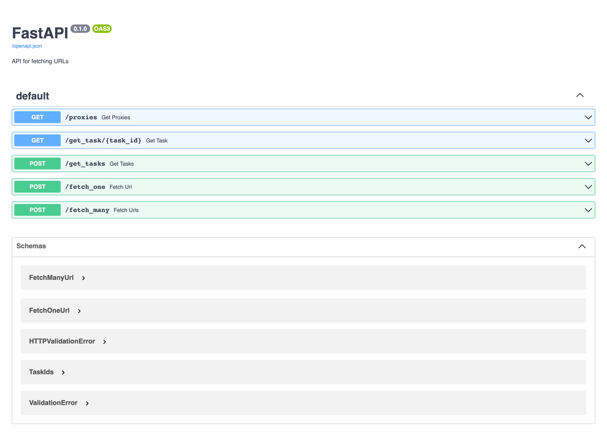

# UnicornScraper

Reliable URLs scraper

### Installation

Required Python 3.8 version and MongoDB server.

`$ pip install -r requirements.txt`

### Run

`$ python3 main.py`

This URLs scraper is REST API application based on FastAPI. 

You can see available functions under `/docs` address - API documentation in OpenAPI format.

### Application modules

#### Proxy Manager
**ProxyManager** class is responsible for updating list of proxy server and also checking their status by periodically getting alive information and measuring latency.

#### Fetch Worker
**FetchWorker**  class is monitoring mongodb collection for retrieving tasks with information about list of urls. There are implemented mechanism for sending custom header POST/GET params, cookies,  user-agent info and also getting cache data.
