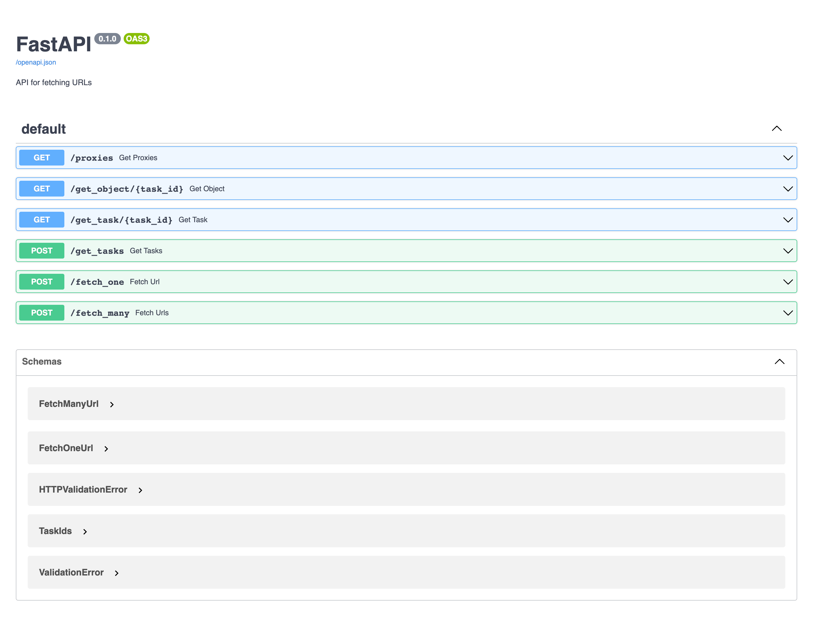

# UnicornScraper

Reliable URLs scraper

### Installation

`$ pip install -r requirements.txt`

### Run

`$ python3 main.py`

This URLs scraper is REST API application based on FastAPI. 

You can see available function under `/docs` address - API documentation in OpenAPI format.

#### Proxy Manager
**ProxyManager** class is responsible for updating list of proxy server and also checking their status by periodically getting alive information and measuring latency
